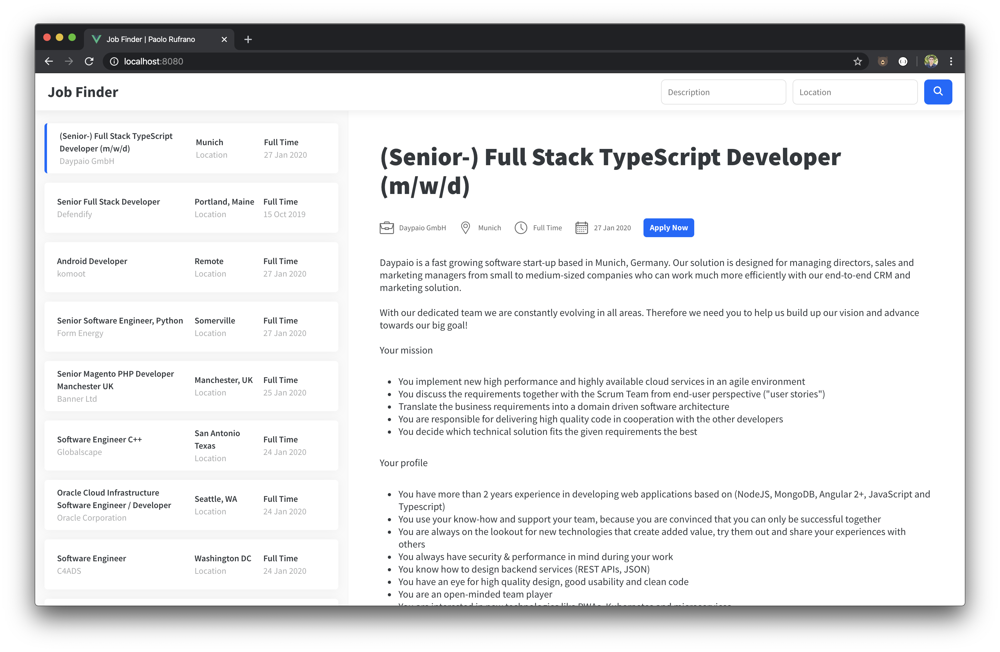

# Job Finder

## About The Project

Job Finder is a simple job hunting tool specifically built for software developers. Data is provided by [GitHub Jobs API](https://jobs.github.com/api).

Project built with [Vue CLI](https://github.com/vuejs/vue-cli).



### Dependencies

* [axios](https://github.com/axios/axios)
* [vue-moment](https://github.com/brockpetrie/vue-moment)
* [vuex](https://github.com/vuejs/vuex)

## Feature set
* Search for a job in specific location
* Search for a job with specific description


## Project setup

```
yarn install
```

Compiles and hot-reloads for development
```
yarn serve
```

Compiles and minifies for production
```
yarn build
```

Lints and fixes files
```
yarn lint
```

## Future improvements

* Error states
* Switch from [vue-moment](https://github.com/brockpetrie/vue-moment) to [Day.js](https://github.com/iamkun/dayjs)
* Pagination on job list in the sidebar
* Order jobs by date
